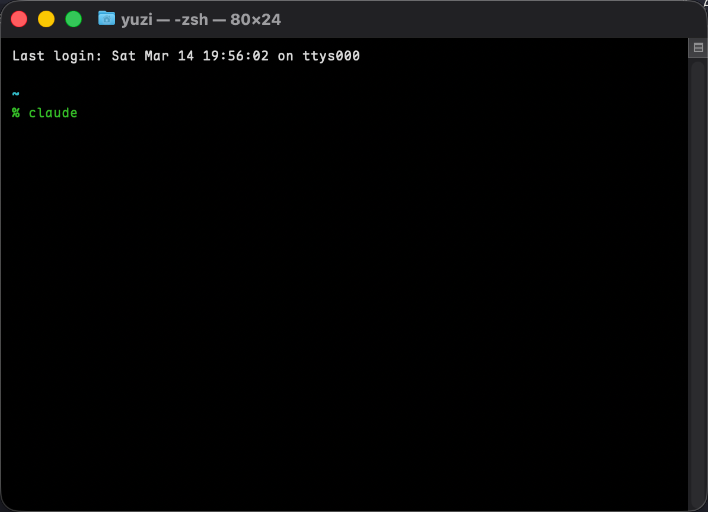
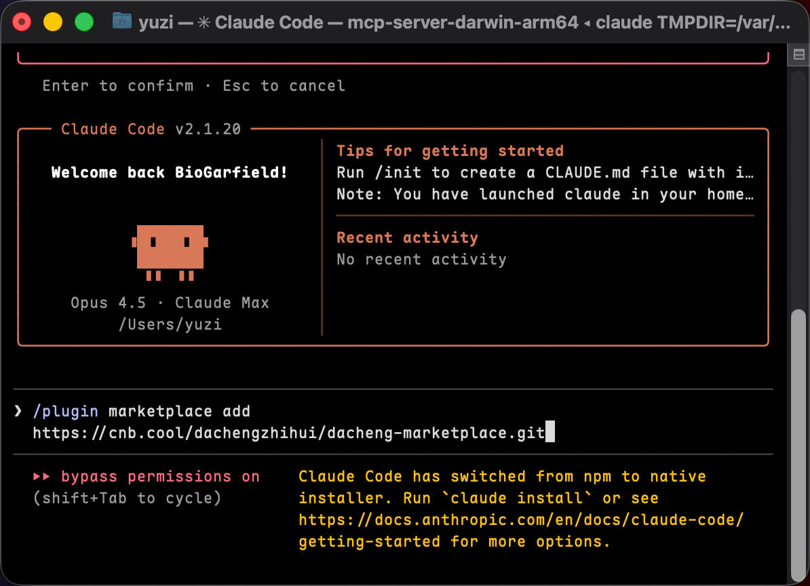
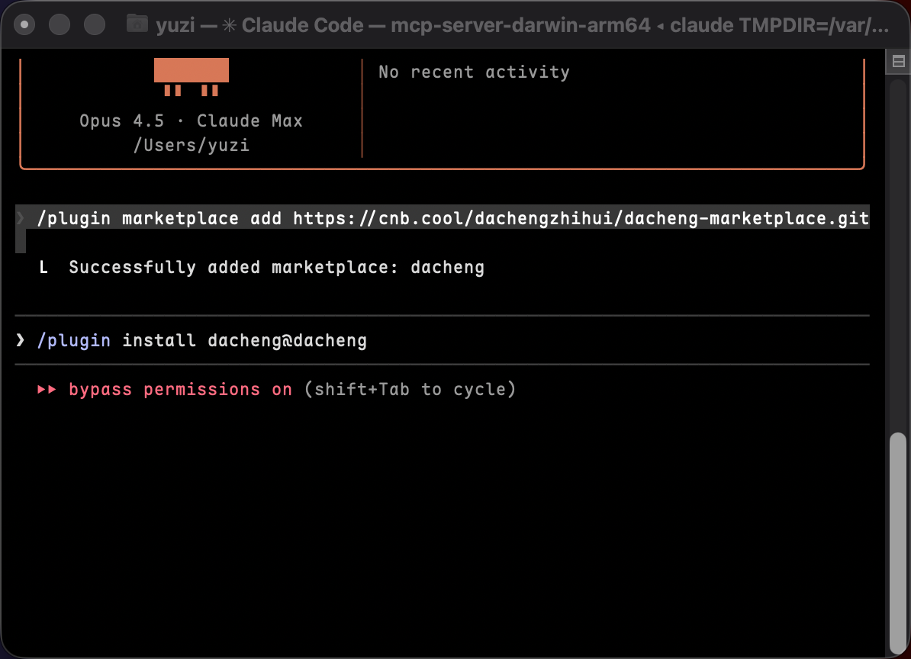
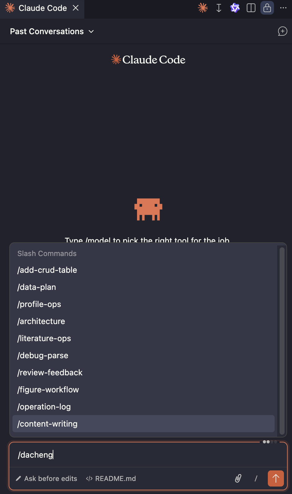

# Dacheng Marketplace — 工作台NEO 技能库

为 Claude Code 提供工作台NEO 项目的数据操作技能（Skills），让 AI 助手高效进行 Parse 数据读取、分析和写入。

## 目录结构

```
dacheng-marketplace/
├── .claude-plugin/
│   ├── plugin.json          # 插件元信息
│   └── marketplace.json     # Marketplace 注册信息
├── skills/                  # 技能定义（12 个）
│   ├── add-crud-table/      # 新增 Parse 数据表及服务层
│   ├── architecture/        # 数据架构、双工作台模式、Parse API
│   ├── content-writing/     # 内容读写（提案/大纲/正文/快照）
│   ├── data-plan/           # 数据分析方案（变量/统计/可视化）
│   ├── debug-parse/         # Parse Server 调试排错
│   ├── figure-workflow/     # 图表数据管理流程
│   ├── literature-ops/      # 文献管理（检索/推荐/验证/标注）
│   ├── operation-log/       # AI 操作日志规范（审计+回滚）
│   ├── profile-ops/         # 个人档案（CV提取/诊断/方向提炼）
│   └── review-feedback/     # 段落级评审反馈数据操作
├── docs/                    # 规划文档
└── README.md                # 本文件
```

## 安装

### 1. 在终端内开启claude


### 2. 注册 Marketplace

```bash
/plugin marketplace add https://cnb.cool/dachengzhihui/dacheng-marketplace.git
```



### 3. 安装插件

```bash
/plugin install dacheng@dacheng
```


### 4. 配置 Parse 连接

在使用 dacheng skills 的项目根目录创建 `.env` 文件：

```env
PARSE_SERVER_URL=http://your-parse-server/parse
PARSE_APP_ID=yourAppId
PARSE_MASTER_KEY=yourMasterKey
```

> Skills 通过读取 `.env` 获取连接信息。如未配置，Claude 会在首次使用时提示你填写。

### 5. 使用方式

可以在vscode中使用



一般来说，使用固定的语句也可以正常使用,例如：

```使用dacheng技能，帮我查看一下叶问的项目列表!```


## 技能一览

| 技能 | 触发场景 | 覆盖能力 |
|------|---------|---------|
| `dacheng:architecture` | 了解数据架构、双工作台模式、Parse API | — |
| `dacheng:add-crud-table` | 新增 Parse 数据表及服务层 | — |
| `dacheng:content-writing` | 读写内容模块（SQ/OL/M/CH） | 4.1-4.3, 3.1-3.4, 4.5 |
| `dacheng:data-plan` | 数据分析方案（变量/统计/可视化） | 6.1-6.3 |
| `dacheng:debug-parse` | Parse API 报错（400/401/130/209） | — |
| `dacheng:figure-workflow` | 图表创建、版本迭代、评审优化 | 7.1, 7.2 |
| `dacheng:literature-ops` | 文献检索、推荐、DOI验证、摘要标注 | 2.1-2.4 |
| `dacheng:operation-log` | Parse 写操作审计日志（自动触发） | — |
| `dacheng:profile-ops` | CV提取、完整度诊断、方向提炼 | 1.1-1.3 |
| `dacheng:review-feedback` | 段落评审、AI 修订、版本快照 | 5.1-5.4 |
| `dacheng:tauri-cnb-autoupdate` | Tauri 自动更新：GitHub 构建签名 + CNB 托管下载（国内） | — |

## 使用方式

### 手动调用

在 Claude Code 对话中直接输入斜杠命令：

```
/dacheng:architecture
/dacheng:debug-parse
```

### 自动触发

Claude 会根据任务内容自动匹配并调用相关技能。例如：

- 需要查询内容段数据 → 自动触发 `content-writing`
- 遇到 Parse 401 错误 → 自动触发 `debug-parse`
- 操作图表版本数据 → 自动触发 `figure-workflow`
- 文献检索或引用管理 → 自动触发 `literature-ops`
- 个人档案或 CV 解析 → 自动触发 `profile-ops`
- 数据分析方案设计 → 自动触发 `data-plan`

### 组合使用

典型流程：

1. `/dacheng:architecture` — 了解数据表结构和 Parse API
2. `/dacheng:add-crud-table` — 新增表的模型和服务层
3. `/dacheng:content-writing` 或 `/dacheng:review-feedback` — 操作具体业务数据

## 注意事项

- **数据表命名**：所有表使用 `work_` 前缀 + snake_case（如 `work_project_report`）
- **Master Key 安全**：仅用于 AI/后端脚本操作，永远不要放在前端代码中
- **Windows 用户**：禁止在命令行参数中直接写中文 JSON，必须保存为 `.js` 文件后 `node 文件名.js` 执行
- **破坏性操作**：执行 DROP/DELETE/TRUNCATE 前必须二次确认
- **版本管理**：历史版本记录只设 `isLatest=false`，不要删除
- **操作日志**：所有 Parse 写操作自动双写日志（本地 `logs/ai-operations.log` + Parse `work_ai_log` 表），支持按会话追踪和回滚

## 更新

```bash
/plugin marketplace update dacheng 
```
## 卸载

```bash
/plugin marketplace remove dacheng
```
